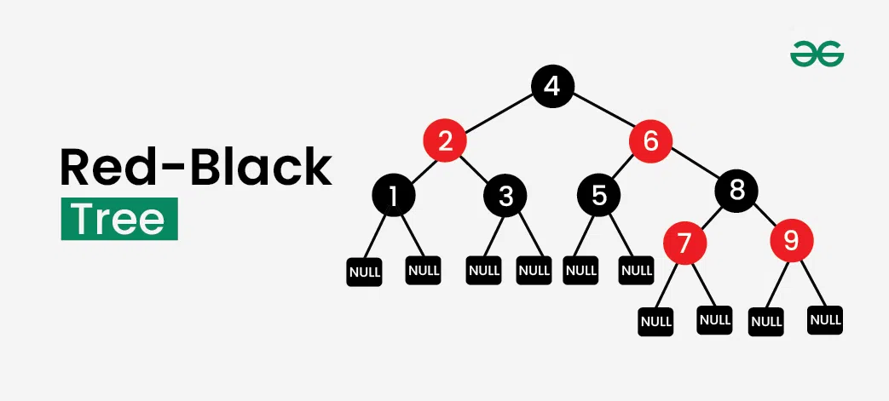
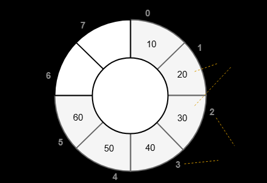

# 컬렉션 (Set, Queue)

## Set

### Set이란?

- `java.util.Set<E>` 인터페이스는 중복 없는 원소들의 집합을 나타내는 컬렉션이다
- 중복을 허용하지 않으며, 순서를 보장하지 않는다
- 중복인지 아닌지를 파악하기 위해서 `equals()`와 `hashCode()`가 중요한 포인트이다

### Set 구현체

#### HashSet

- 내부 구조는 HashMap 기반이다
    - 실제로 내부에 HashMap을 가지고 있다
    - 저장되는 값은 key로 들어가고 value는 항상 고정된 더미 객체(`new Object()`)를 사용한다
- 순서가 없다
- 성능
    - 평균적으로 삽입,삭제,조회 모두 O(1)으로 빠르다
    - 해시 충돌이 많으면 최악의 경우 O(n)이다
        - 자바 8 이전 : 무조건 LinkedList로 연결
        - 자바 8 이후 : 같은 버킷 내의 노드 수가 많은 경우 Red-Black Tree로 변환
- 대략적이 내부 동작 (`add(e)` 할 때)
    1. `e.hashCode()`로 해시 값을 구함
    2. 해시 값을 이용해 버킷 인덱스를 결정
    3. 버킷에 이미 같은 객체가 있는지 hashCdoe + equals로 확인
    4. 없으면 새로 넣고, 있으면 무시

Red-Black Tree



- Red-Black Tree(RBT)는 균형 이진 탐색 트리의 한 종류로 삽입/삭제 시 트리 높이를 O(log n) 안에서 유지하도록 설계된 자료구조이다
- 단순 BST는 1 -> 2 -> 3 -> 4 와 같은 삽입 순서에서 LinkedList처럼 변형될 수 있다 O(n)
- RBT의 규칙
    1. 모든 노드는 Red 또는 Black으로 색이 반드시 정해져 있어야 한다
    2. 루트는 항상 Black
    3. 모든 Leaf(NIL 노드)는 모두 Black
    4. Red 노드는 연속해서 두 번 나오면 안된다
    5. 각 노드에서 리프까지의 모든 경로는 동일한 수의 Black 노드를 가져야 한다
- 탐색/삽입/삭제 모두 O(log n)

#### LinkedHashSet

- 순서가 유지되는 HashSet
- 내부 구조는 HashSet + 이중 연결 리스트이다
    - LinkedHashSet은 LinkedHashMap을 상속하는데 이는 HashMap을 상속하며 전체 요소를 연결하는 이중 연결 리스트를 가지고 있다
- 장점
    - 빠른 속도
    - 데이터 삽입 순서가 보장된다
    - HashSet과 동일한 시간 복잡도를 가진다
        - add : O(1)
        - remove : O(1)
        - contains : O(1)
        - iteration : O(n)
- 최근 방문한 페이지 목록이나, 캐시 등 중복 없는 집합인데 순서가 필요할 때 사용

#### TreeSet

- 정렬된 Set
- 정렬 기준은 기본적으로 오름차순이나, `Comparator`로 정렬 기준을 전달할 수 있다
- 내부적으로 TreeMap을 사용하고, TreeMap은 Red-Black Tree 자료구조를 사용해 요소를 자동 정렬한다
    - TreeMap은 key 기반 Map이므로 TreeSet의 값은 TreeMap의 key이며 value는 더미를 넣는다
- 시간 복잡도
    - 삽입/삭제/조회 모두 O(log n)
- 집합인데 항상 정렬된 채로 유지되어야 할 때 사용

#### EnumSet

- enum 타입 전용 Set
- 내부 구현은 비트 벡터로, 각각의 enum 상수를 비트 하나로 표현해 매우 빠르고 메모리도 적게 사용한다
- 장점
    - HashSet보다 훨씬 빠르고, 메모리 효율이 좋다
- 상태 플래그, 옵션 조합 등 enum 값들의 집합이 필요할 때 사용한다

## Queue

### Queue란?

- `java.util.Queue<E>`는 FIFO 자료구조를 나타내는 인터페이스이다
- 중복이 허용되고, 인덱스로 접근할 수 없다

### Queue 구현체

#### LinkedList

- 내부 구조는 이중 연결 리스트이며 삽입/제거 모두 O(1)(Node의 참조를 알고 있을때. 모를 땐 O(n))이고, 순서가 유지된다
- 장점
    - 구현이 단순하고 일반적인 큐 용도로 적합하다
    - Deque 기능도 제공한다 (`LinkedList`는 `Deque` 인터페이스도 구현한다)
- 단점
    - 인덱스로 접근이 불가능하다
    - ArrayDeque보다 느린 경우가 있다 (포인터 기반 구조라서 캐시 친화적이지 않다)

#### ArrayDeque

- Queue이자 Deque이므로 다음의 둘 다 가능하다
    - `offer`/`poll` -> 큐로 사용
    - `push`/`poll` -> 스택으로 사용
- 내부 구조는 배열을 원형으로 사용하는 구조이며 자동으로 확장된다
- 앞/뒤에 데이터를 삽입/삭제 하는것은 O(1)



- 장점
    - LinkedList보다 빠르다 (배열 이나 + 캐시 히트 좋음)
    - 스레드 안전하지는 않지만 단일 스레드에서는 가장 빠르다
    - Stack보다 좋고 LinkedList보다 큐로서 더 빠른 성능을 가진다
- 단점
    - 용량 확장이 필요한 경우 전체 복사가 일어날 수 있다

#### PriorityQueue

- 우선순위 큐
- 내부 구조는 이진 힙 + 배열로 구현된다
    - 형태만 트리이고 실제 저장은 배열이다
    - 노드들은 다음 규칙으로 배열 인덱스로 매핑된다
    - ```java
        int parent = (i - 1) / 2;
        int left = 2 * i + 1;
        int right = 2 * i + 2;
        ```
- 힙 동작 방식
    - add 시
        1. 마지막 인덱스에 삽입
        2. 부모와 비교하여 작은쪽을 위로 올리는 상향 재정렬
    - poll 시
        1. root(최소값)을 제거
        2. 마지막 요소를 root로 올림
        3. 자식과 비교하여 더 작은 쪽으로 내려보내는 하향 재정렬
    - 그래서 항상 root가 최소값으로 유지된다
- 정렬 기준 기본은 오름차순이지만 커스텀 가능하다(Comparator)
- 장점
    - 정렬 순서 기준 가장 앞에 있는 값이 빠르게 나온다
    - 시간 복잡도
        - add -> O(log n)
        - poll -> O(log n)
        - peek -> O(1)
- 단점
    - 순서가 FIFO가 아니다
    - 전체 순회를 하면 정렬된 것처럼 보일 수 없고 내부 힙 상태 그대로 나온다

#### BlockingQueue

- Queue 중에서 동시성 + 스레드 간 안전한 데이터 전달을 위해 만들어진 것이 BlockingQueue이다
- 대표 구현체
    - ArrayBlockingQueue
    - LinkedBlockingQueue
    - PriorityBlockingQueue
    - SynchronousQueue
    - DelayQueue
- 특징
    - 큐가 꽉 차면 put()은 블로킹
    - 큐가 비면 take()는 블로킹
    - 멀티스레드에서 안전 (thread-safe)